<div align="center">
  
</div>

<div align="center">
  <a href="https://github.com/vineethsaivs">
    
  </a>
</div>

<p align="center">
  
  
  
</p>

---

## 🌌 `whoami`

The universe is 13.8 billion years old. Somewhere along the way, atoms arranged themselves into things that could ask questions about other atoms. I think that's the wildest fact in existence, and most of what I do is downstream of that wonder.

By day, I build **agentic AI workflows** at **AT&T**: multi-process routing, computer-use agents, LangGraph pipelines that turn screen recordings into executable automations. On the side, I lead AI/ML at **Nabu Tutor**, an AI-powered USMLE prep platform, where I work on agentic RAG, long-term memory systems, LLM fine-tuning, and voice tutoring. Before all this: Google Cloud, Foundation AI, Aion Labs.

When I'm not wiring LLMs into production, I'm probably reading about black holes, watching City fall apart in a winnable match, or losing a chess game I should've won.

---

## 🛰️ Current orbit

```yaml
location:    San Francisco, CA 🌁
role:        AI/ML Engineer @ AT&T  ·  Lead AI/ML @ Nabu Tutor
building:    Memory V2 (Mem0 2.0 + pgvector + Redis)
shipping:    Agentic pipelines · screen-recording → workflow → execution
learning:    GRPO · RL for agents · multimodal reasoning
open_to:     agentic AI collabs · hackathon teams · deep technical convos
find_me_at:  SF AI hackathons · Arize Observe (Jun 4, Ferry Building)
```

---

## 🧠 The arsenal

<div align="center">

### LLMs · Agents · RAG


### Deep Learning · Fine-tuning


### Vector · Memory · Data


### Cloud · MLOps


### Frameworks · Voice · Automation


### Languages


</div>

---

## 📡 Signals from the observatory

<div align="center">
  
  
</div>

<div align="center">
  
</div>

<div align="center">
  
</div>

---

## 🪐 Beyond the keyboard

> Stuff that makes me a person, not a model.

- 🌌 **Cosmos:** astrophysics, black holes, exoplanets, the early universe. If AI didn't exist, I'd be doing this.
- 💙 **Manchester City:** through the trebles, the heartbreaks, the existential VAR decisions. Cityzen for life.
- 🎾🏎️ **Tennis & F1:** weekend rituals. Slams and Sundays.
- ♟️ **Chess:** `vineethsaivs` on chess.com. Down for a game anytime.
- 🍥 **Naruto:** *"Hard work is worthless for those that don't believe in themselves."* Believer.
- 🥷 **SF hackathon scene:** Zero to Agent, OpenEnv, Shack15 regular. Built a VLM/GRPO Duck Hunt agent that hit 60.9% on Horizon-Min. Always down to team up.

---

## 🌠 Connect

<p align="center">
  <a href="https://linkedin.com/in/vineethsaivs"></a>
  <a href="https://twitter.com/vineeth_sai_vs"></a>
  <a href="mailto:vineethsai4444@gmail.com"></a>
  <a href="https://vineethsaivs.github.io/PortfolioWebsite/"></a>
  <a href="https://chess.com/member/vineethsaivs"></a>
</p>

---

<p align="center">
  <i>"Somewhere, something incredible is waiting to be known."</i><br>
  <sub>- Carl Sagan</sub>
</p>

<p align="center">
  <sub>⭐ Made with cosmic curiosity and probably too much coffee.</sub>
</p>
